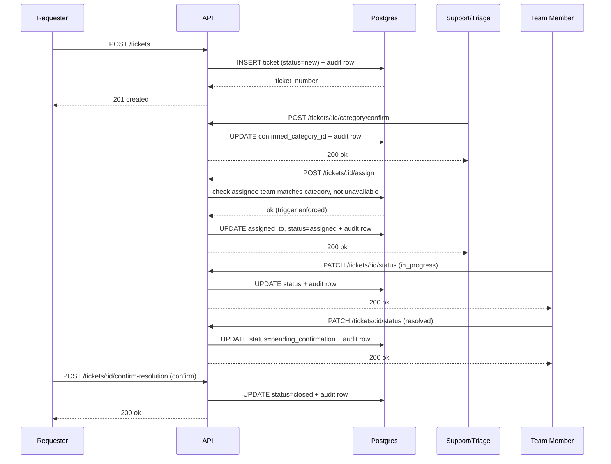
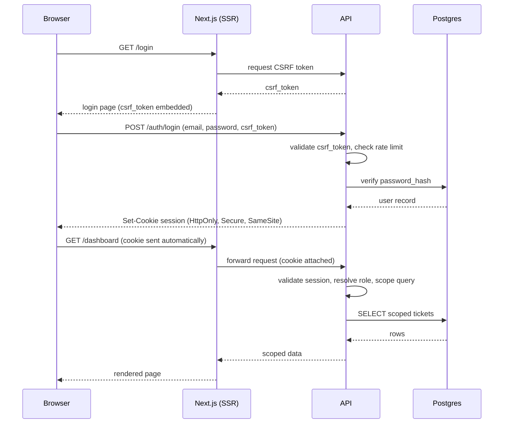

# Sequence Diagrams — Support Ticketing System

Mermaid source, rendered in chat during the design phase. Companion to API_CONTRACT.md.

---

## 1. Core ticket lifecycle (create → triage → assign → resolve → confirm)

**Key property this makes visible:** every state-changing call writes an audit row in the same step as the mutation — no code path exists that can change ticket state without also logging it (ARCHITECTURE_REVIEW.md §2.2). The `check assignee team matches category` step is the API-level mirror of the DB trigger in DB_SCHEMA.md — the API check gives a clean error message, the DB trigger is the actual, unbypassable guarantee.

**Not shown, but real:** the dispute path (requester disputes → reopened → back to the same Team Member, FR-9.4) is a separate, shorter sequence off the same `pending_confirmation` state — worth drawing if useful later, omitted here to keep the main flow readable. There is deliberately no auto-close sequence: a ticket in `pending_confirmation` stays there indefinitely until the requester acts, with no worker job that times it out (REQUIREMENTS.md §4.9).

---

## 2. Auth flow (login, SSR, cookie session, CSRF)

**Why cookie-based, not a bearer token in browser storage:** a token in `localStorage`/`sessionStorage` is readable by any injected script — an XSS vulnerability becomes a full session-theft vulnerability. An `HttpOnly` cookie never touches JavaScript at all. The direct cost of that choice is CSRF exposure (cookies are sent automatically by the browser on every request to the domain, including ones the user didn't intend), which is why every mutating request requires a CSRF token — this isn't a separate feature, it's the other half of the cookie decision.

**SSO variant (not diagrammed):** same shape after the redirect — `GET /auth/sso/:provider` sends the browser to the provider, the provider redirects back to `/auth/sso/:provider/callback`, and from that point the flow rejoins the diagram above at "Set-Cookie session."
